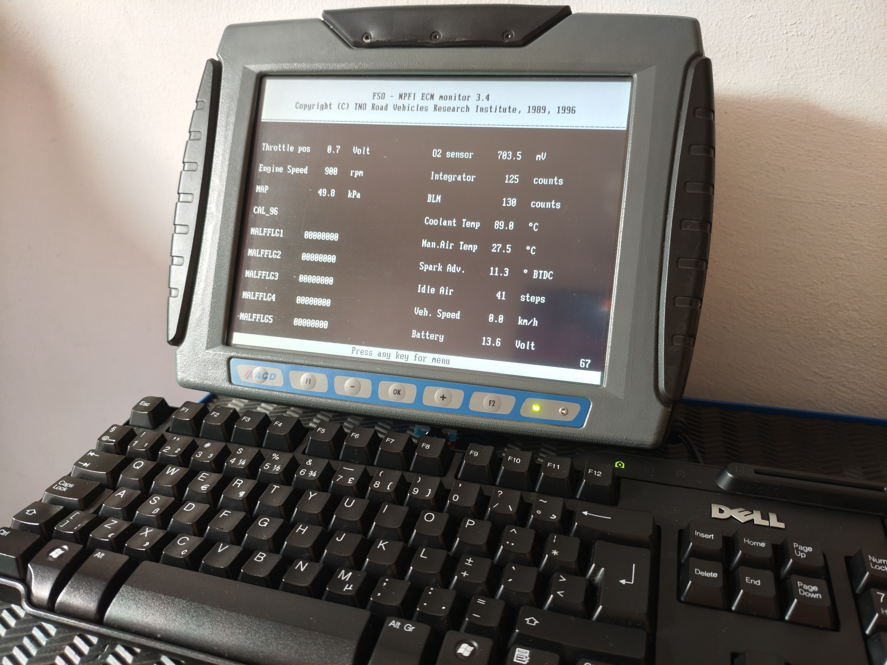
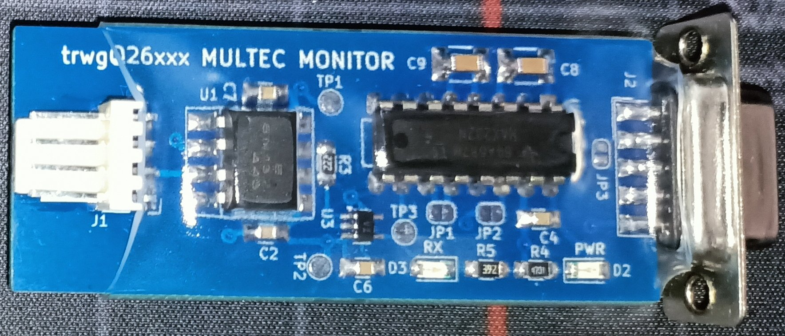
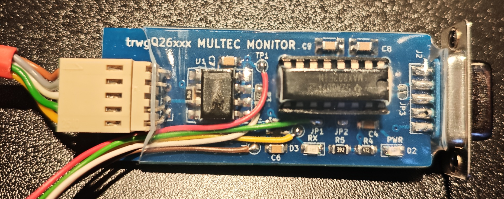
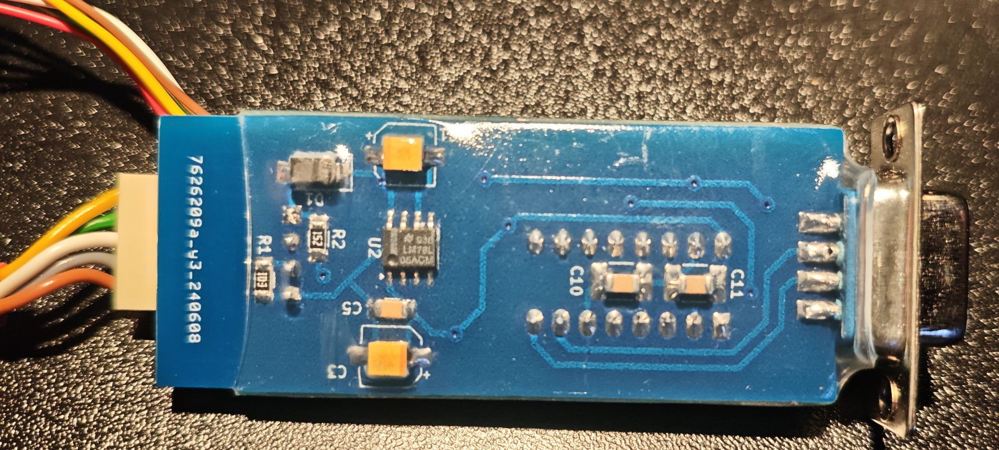

# MULTEC MONITOR

Materials related to FSO Polonez ("Ponton") ECUs, primarily the 1.6L MPI Delphi/Multec ECU.

This repository contains:
- A design for an alternative diagnostic cable for the Multec Monitor software.
- A COM port tester program for MS-DOS.
- An Arduino-based emulator for the Multec ECU signal.
- A COM port latency checker for Linux PCs.
- A fix for the Polonez Bosch MA1.7 ECU that enables it to be diagnosed using VCDS.

Contact : trwgQ {leechers not welcome} 26 {remove spaces} xxx {remove spaces} {at} proton {dot} me

# Disclaimer

I do not consent to the use of all or part of the project for commercial purposes!

Nie wyrażam zgody na wykorzystanie całości bądź części projektu w celach zarobkowych!

# License

Shield: [![CC BY-NC-SA 4.0][cc-by-nc-sa-shield]][cc-by-nc-sa]

This work is licensed under a
[Creative Commons Attribution-NonCommercial-ShareAlike 4.0 International License][cc-by-nc-sa].

[![CC BY-NC-SA 4.0][cc-by-nc-sa-image]][cc-by-nc-sa]

[cc-by-nc-sa]: http://creativecommons.org/licenses/by-nc-sa/4.0/
[cc-by-nc-sa-image]: https://licensebuttons.net/l/by-nc-sa/4.0/88x31.png
[cc-by-nc-sa-shield]: https://img.shields.io/badge/License-CC%20BY--NC--SA%204.0-lightgrey.svg

# Directories organization

- **software** - PC and Arduino software written in C.
- **PCB** - The diagnostic cable PCB design, created in KiCad.
- **BOSCH_ECU** - A Python-based fix for the Polonez Bosch MA1.7 ECU that enables diagnostics using VCDS.

# Developer cable

Compared to the simple resistor-based version, this cable has the following advantages:

- The use of an optocoupler allows diagnostics to be performed on most Polonez ("Ponton") vehicles where the Check Engine (CEL) indicator has been removed. The ECU’s 160-baud signal output is an open-collector (OC) type, so without proper biasing the signal disappears together with the bulb.

- The MAX232 IC ensures correct RS-232 voltage levels at the computer connector, regardless of whether the PC provides a sufficiently low voltage on the RTS pin, and regardless of the condition of the vehicle battery.

**PIN** | **SIGNAL** | **WIRE COLOR**
:---: | :---: | :---:
1 | VCC | Red
2 | CTS | White
3 | #CTS | Yellow
4 | TX-RX | Green
5 | GND | Brown

# Using Polonez 0 261 204 242 Bosch ECU fix

Reading the 87C510 should be relatively straightforward with an 87C510 adapter and reader, such as the one from the [FLT module reader](https://github.com/trwgQ26xxx/FLT_module_reader).

Burning a new 87C510, however, could be tricky in this day and age, since suitable programmers and blank chips are becoming increasingly difficult to source. I would recommend using a modern flash chip with an adapter, such as [87C510 to 27C512](https://github.com/y23tanaka/87c510to27C512).

This approach should make the process much more practical: read the original ECU ROM, make the required changes to the image, and then program the modified firmware onto a readily available modern flash chip. It also allows you to keep the original 87C510, along with an untouched dump of its contents, as a backup.
